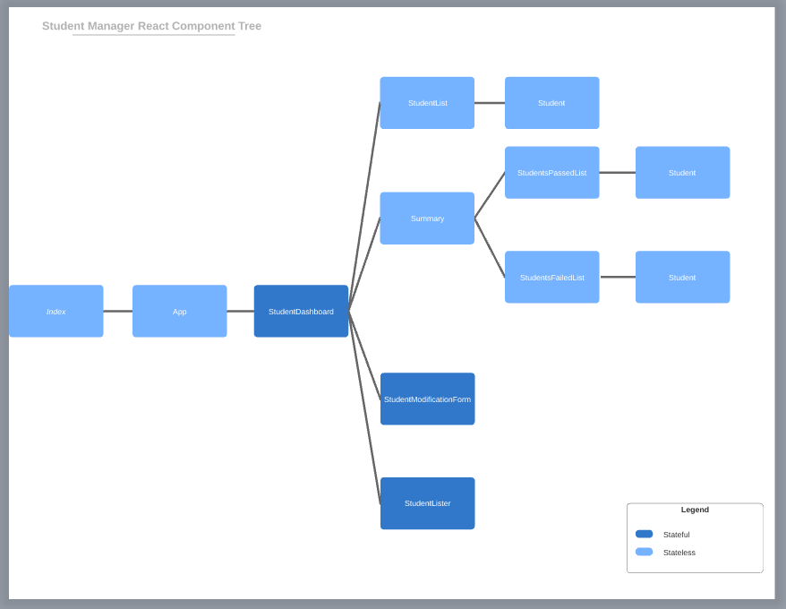
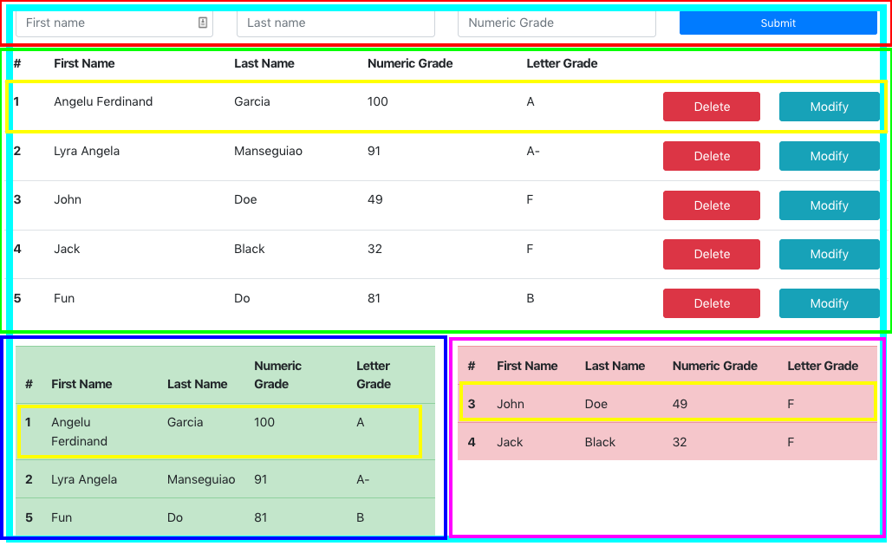

# Student Manager
This is the first App I developed with ReactJS. It simulates a typical teacher's gradebook.
## Important concepts learned
- Stateful Class Components that hold variable-like "states"
- Stateless Functional Components only used for rendering and formatting elements
- Stateful Functional Components made possible with React useState hook
- Passing and binding event handlers from parent component to child as props
## Tools used
- react-bootstrap
- ReactJS
## Component Tree

### Stateful Components
- StudentDashboard |	Parent to the main components and holds the current students added as states (Light blue)
- StudentModificationForm	|	Returns a render of a modal form and holds the form entries as states (Pops up when 'Modify' is clicked)
- StudentLister	|	Returns a render of input elements needed to add a student and holds the input entries as states(Red)
### Stateless Components
- Index	|	Generated by create-react-app
- App | Generated by create-react-app
- StudentList | Returns a render the table where content is the list of students added (Green)
- Summary | Returns a render of StudentPassedList and StudentFailedList (Dark Blue + Pink)
- StudentPassedList | Returns a render of the table where content is the list of students with letter grade !== F (Dark Blue)
- StudentFailedList | Returns a render of the table where content is the list of students with letter grade == F (Pink)
- Student | Returns a render of each row in the tables of StudentPassedList, StudentFailedList, and StudentList (Yellow)
